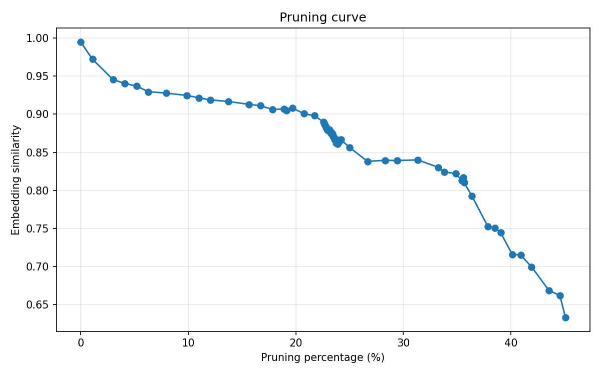

# PruneForge

PruneForge is a zero-training LLM pruning pipeline that compresses decoder-only models by removing MLP channels, attention heads, and whole layers while tracking semantic fidelity with a large embedding model. The goal is to maximize compression subject to a similarity threshold, without any finetuning.

## Core idea

Agents usually need an LLM for a single task, not the whole set of knowledge the model carries. We can treat the full model knowledge as M and the task-specific subset as N. If the task only needs N, the rest is redundant for that agent. PruneForge finds N using only a small set of example questions, with no training and no dataset beyond those examples.

Given a base model and a calibration set of prompts:
- Generate teacher outputs with the full model.
- Encode teacher and candidate outputs with a large embedding model.
- Use cosine similarity as the quality signal.
- Iteratively propose structured pruning operations and accept them if quality stays above an adaptive threshold.

The search is stochastic-greedy with memory: it prioritizes candidates that historically cause the smallest quality drops, while occasionally exploring other options.

## What it prunes

- MLP width (drop channels)
- Attention heads (drop head groups)
- Whole layers

The pruning schedule is staged and adaptive, and it automatically relaxes thresholds when compression stalls.

## Results (latest run)

From `pruning_debug.jsonl`:
- Baseline similarity: **0.9951**
- Final similarity: **0.6330**
- Compression: **45.1%** (8.03B → 4.41B parameters)
- Accepted operations: **65**
- Remaining layers: **22**

This is a no-retraining run. The score reflects semantic similarity between full-model outputs and pruned-model outputs, measured by Qwen3-Embedding-4B.



## Files

- `prune_llama.py` - main pruning engine
- `pruning_debug.jsonl` - JSONL event log for a run
- `pruning_recipe.json` - saved pruning recipe (auto-saved)
- `infer_pruned.py` - simple inference with a pruned model
- `plot_pruning_curve.py` - plot similarity vs pruning percentage

## Quick start

Set your environment and run:

```
python prune_llama.py
```

This auto-saves `pruning_recipe.json`.

To load a pruned model and ask a question:

```
python infer_pruned.py
```

## Plotting the pruning curve

```
python plot_pruning_curve.py
```

This reads `pruning_debug.jsonl` and writes `pruning_curve.png`.

## How it works (short)

1. Generate teacher answers from the full model.
2. Embed teacher answers with Qwen3-Embedding-4B.
3. Propose a pruning operation.
4. Score the pruned model on a small batch; if it passes, score on full train set.
5. Accept if score stays above the current threshold and per-step drop limit.
6. Repeat with adaptive thresholds until iterations are exhausted.

The system is designed to be repeatable, inspectable (JSONL logging), and recipe-based (no weight saving).
